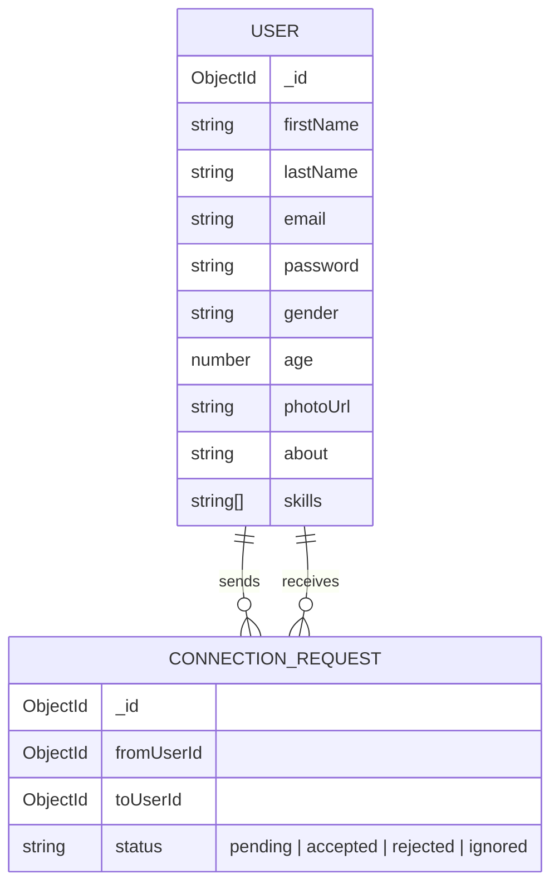

# DevTinder – Developer Networking Platform 👨‍💻🔥

DevTinder is a specialized networking application designed for developers to connect, collaborate, and build a community. Think of it as "Tinder for Developers"—where you can swipe through profiles, view tech stacks, and connect with like-minded engineers.

## 🏗 Architecture Overview

The project follows a **MERN (MongoDB, Express.js, React, Node.js)** stack architecture with a client-server model. It implements a RESTful API and uses Redux for state management to ensure a smooth user experience.


1.  **Frontend**: A Single Page Application (SPA) built with React and styled with Tailwind CSS + DaisyUI.
2.  **Backend**: An Express.js server handling business logic, authentication, and database interactions.
3.  **Database**: MongoDB Atlas used for storing user profiles, connections, and requests.
4.  **Security**: JWT-based authentication stored in HTTP-only cookies to prevent XSS attacks.

---

## 📊 ER Diagram (MongoDB)

DevTinder uses a document-oriented schema designed for fast reads and relationship management.



---

## 🔄 Request Flow

1.  **Authentication**: User sends credentials → Server validates → Generates JWT → Sends JWT via **HTTP-only Cookie**.
2.  **Protected Routes**: Frontend sends request → Server Middleware checks Cookie → Validates JWT → Forwards to Controller.
3.  **Connection Logic**: User A swipes Right on User B → `ConnectionRequest` created as `interested` → User B views "Requests" → Accepts → Status changes to `accepted`.

---

## 🛠 Tech Stack

* **Frontend**: React.js, Redux Toolkit, React Router Dom, Tailwind CSS, DaisyUI.
* **Backend**: Node.js, Express.js.
* **Database**: MongoDB (Mongoose ODM).
* **Authentication**: JSON Web Token (JWT), bcrypt.js, cookie-parser.
* **Validation**: Validator.js.

---

## 📂 Folder Structure

```text
devTinder/
├── devTinder-web/          # Frontend (React)
│   ├── src/
│   │   ├── components/     # UI Components (Navbar, Footer, Feed)
│   │   ├── utils/          # Redux Store, Slices, Constants
│   │   └── App.js          # Routing logic
├── devTinder-backend/      # Backend (Node/Express)
│   ├── src/
│   │   ├── models/         # Mongoose Schemas (User, ConnectionRequest)
│   │   ├── routes/         # Express Routers (auth, profile, request, user)
│   │   ├── middlewares/    # Auth Middleware
│   │   └── app.js          # Server entry point
└── README.md
```

---

## 🔌 API Endpoints

### Auth Router
* `POST /signup` - Register a new developer.
* `POST /login` - Authenticate user and receive cookie.
* `POST /logout` - Clear session cookie.

### Profile Router
* `GET /profile/view` - Fetch logged-in user details.
* `PATCH /profile/edit` - Update profile information.
* `PATCH /profile/password` - Update password (Secure).

### Connection Router
* `POST /request/send/:status/:toUserId` - Send 'interested' or 'ignored' request.
* `POST /request/review/:status/:requestId` - Accept or Reject incoming requests.

### User Router
* `GET /user/requests/received` - View pending connection requests.
* `GET /user/connections` - View all accepted connections.
* `GET /feed` - Get developers for the feed (excluding self, connections, and ignored).

---

## ✨ Features

* **Secure Authentication**: Passwords hashed with `bcrypt` and sessions managed via secure cookies.
* **Smart Feed**: An algorithm that filters out developers you have already interacted with.
* **Dynamic Profile**: Edit your tech stack, bio, and profile picture.
* **Real-time UI**: Redux Toolkit ensures the UI updates instantly when you accept a request or edit your profile.
* **Responsive Design**: Fully functional on Mobile, Tablet, and Desktop.

---

## 🚀 Future Improvements

* **Real-time Chat**: Integration with Socket.io for instant messaging between connections.
* **Premium Membership**: Razorpay integration for features like "Who viewed your profile".
* **Advanced Filtering**: Filter developers by specific skills (e.g., "Show only MongoDB experts").
* **GitHub Integration**: Fetch and display repositories directly on the user profile.

---

### 🛠 Installation

1.  Clone the repo: `git clone https://github.com/Anuj27aKamboj/devTinder/`
2.  Install dependencies for both folders: `npm install`
3.  Create a `.env` file in the backend with `PORT`, `MONGODB_URI`, and `JWT_SECRET`.
4.  Run the backend: `npm run dev`
5.  Run the frontend: `npm start`
